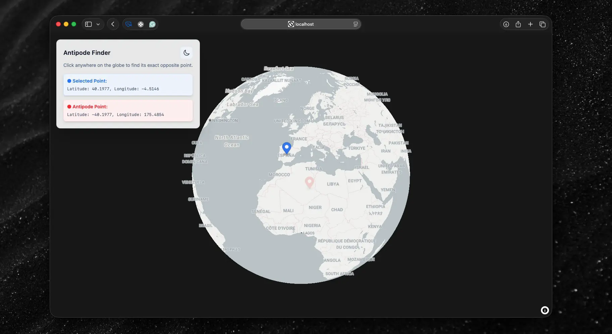

# 🌍 Antipode Globe Finder

A sleek, interactive 3D globe web application built to find the exact opposite point (antipode) of any location on Earth. Click anywhere on the globe, and see the antipode point.



## 🛠️ Tech Stack

- **Framework:** React (Vite)
- **Styling:** Tailwind CSS
- **Mapping Engine:** [MapLibre GL JS](https://maplibre.org)
- **Map Tiles:** [Carto](https://carto.com/basemaps/)

## 🚀 Getting Started

1. **Clone the repository:**

   ```bash
   git clone https://github.com/mstih/antipode-globe.git

   cd antipode-globe
   ```

2. **Install dependencies:**
   ```
   npm install
   ```
3. **Run it:**
   ```
   npm run dev
   ```
4. **Open `http://localhost:5173` in your browser and try it out.**
